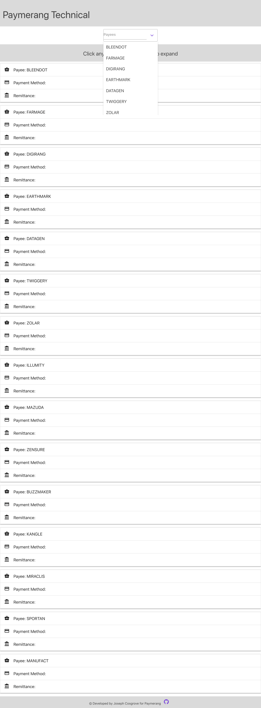

# Paymerang Technical 

An application designed for Paymerang to present payment data in a clear, concise manner. This application was developed using React in tandem with Materialize and Grommet and was deployed using Github.

## Table of Contents

* [Installation](#installation)
* [Usage](#usage)
* [License](#License)
* [Contributing](#Contributing)
* [Tests](#Tests)
* [Questions](#Questions)

## Installation
This web application is deployed to Github and there is no need for installation. It can be accessed at: https://jyc5331.github.io/paymerang-technical/

## Usage

The landing page features collapsible tables populated with data from the provided JSON. There is a search option that will filter your results. 

## License:
MIT
For more information on licensing, click on the badge at the top of this file. 

## Contributing

Created by: jyc5331 

## Questions

You can contact me at: jcosgrovecoding@gmail.com

You can check out my github profile here: [jyc5331](https://github.com/jyc5331)
